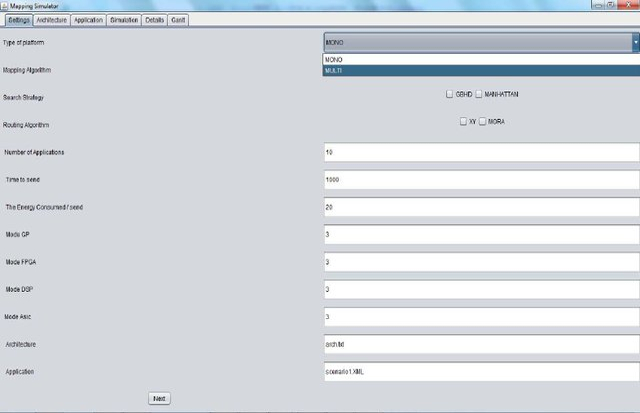
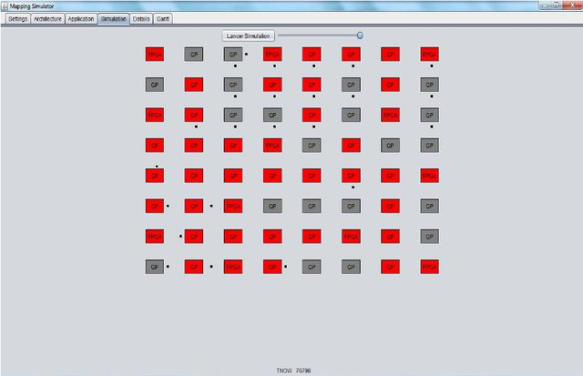
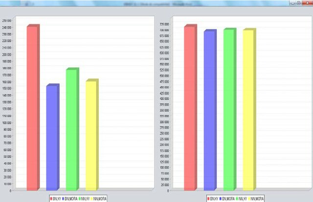

## DynMapNoCSIM  :  A  Dynamic  Mapping  SIMULATOR  for  Network  on  Chipbased  MPSoC

 Figure 1 | Figure 2 | Figure 3 |
:---:|:-----:|:-----:|
 | |  |
--------------------------------------------------

More information can be found [here](https://www.researchgate.net/publication/279181374_DynMapNoCSIM_A_dynamic_mapping_SIMULATOR_for_network_on_chip_based_MPSoC)